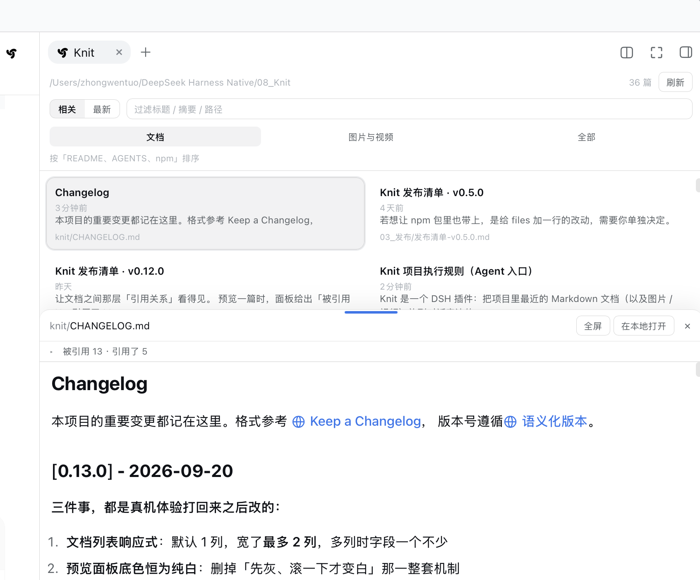

# Knit

> Your agent writes 20 documents a day. You can't find the one you just saw.
> Knit puts them next to the conversation — whatever you're talking about, the relevant doc is on top.
>
> **Your agent has the same problem.** It gets the same ranking as a tool — the ranked documents plus the passage that matched in each.



*Screenshot from a real machine, not a mock-up: a workspace with 16 documents, the list plus an
inline preview.*
*The top line follows whatever you're talking about; when there isn't enough conversation yet it
falls back to newest-first and states its basis.*

Scans Markdown / images / video across the project folder · Order follows the conversation · No model calls, no network

```sh
dsh plugin --profile web add dsh-knit
```

---

## "Isn't this just a recent-files list?"

**Fair. Two differences:**

1. **Scope** — a recent-files list only remembers files you *opened*. Knit scans the
   **entire project folder**. Restart DSH, start a new session, come back tomorrow: it's all still there.
2. **Order** — that list sorts by time. Knit sorts by **what you're currently talking about**.

Three sentences on what it is:

1. Scans **every Markdown file in the project folder**, not just the ones from this turn —
   they survive restarts, new sessions, and days.
2. The order **follows the conversation**: talk about architecture and the architecture doc
   floats up; talk about competitors and the competitor analysis floats up.
3. **No model calls, no network egress**: plain local string matching — zero latency,
   zero cost, your documents never leave the machine.

---

## How "relevant" is computed

No magic, just string operations. Three steps:

**1. Read the conversation.** The host takes the last 6 user/assistant messages, and only
counts real user messages (`agent.inject()` synthetic context would drag the topic off course).
Newer messages weigh more: 3 / 2 / 1 / 1 …

**2. Extract keywords.**

- **ASCII words** — high value, one occurrence is enough (`chokidar`, `mtime`)
- **Chinese 2/3-grams** — either occurring twice, or appearing in the newest message
- **Drop fragments that straddle a word boundary.** Chinese has no word boundaries, so
  n-grams glue the last character of one word to the first of the next (「图片和」, 「个插」,
  「的排」). They share one trait — **the first or last character is a pure function word** —
  and are dropped. Leave them in and they fill every candidate slot, pushing the real words
  (「图片」, 「排序」) out of the query entirely
- stop-word filtering plus greedy de-overlap (picking「相关性排序」drops「相关性」and「排序」)

**3. Score the documents — BM25.**

```
IDF per term first: rarer in the corpus means more valuable
                    ln(1 + (N - df + 0.5) / (df + 0.5))
then a weighted sum over fields: title ×4  +  summary ×2  +  first 2500 chars of body ×1
each field saturated and length-normalised (k1 = 1.2, b = 0.3 / 0.5 / 0.75)
plus a 10% recency nudge (relevance still dominates)
```

**Why BM25 and not "hits × weight"** (the original approach, since replaced):

- with no IDF, a term that appears **everywhere** (the project name) is worth as much as a
  rare one — so the frequent term discriminates nothing and dilutes the rare ones
- with no length normalisation, **a long document wins by piling up hits**
- capping hits at 6 was a hand-drawn knee; `k1` / `b` exist precisely for this

Measured on `test/eval/fixture.mjs` (21 cases, both engines on the same corpus):

| | top-1 | MRR |
|---|---|---|
| old (weighted hits) | 76.2% | 0.830 |
| **BM25** | **95.2%** | **0.976** |

That eval runs inside `npm test`, and the baseline is **recomputed each run** from the old
engine frozen in `test/eval/legacy.mjs` — so "the new engine must be clearly better" is
verified automatically rather than asserted against a hard-coded number.

**Against counting keywords yourself** (`knit/tools/scale-benchmark.mjs`, N = 20/60/180/540):
the corpus is built with a real trap — 12 short, focused topic documents, plus a pile of long
distractors that mention every topic five times without explaining any of them (which is what a
real project's CHANGELOG looks like). Half the topic documents have descriptive filenames, half
are opaque.

| Approach | Descriptive filenames | Opaque filenames | MRR vs. scale |
|---|---|---|---|
| **Knit (BM25)** | **100%** | **100%** | **1.000 (flat)** |
| `grep -c` keyword counting | 17% | **0%** | 0.313 → **0.089** |
| Filenames only | 100% | **0%** | 0.602 |

Three things: **the ranking beats counting keywords yourself** (so having the agent recompute it
is irrational); **filename matching only works when names describe content**, and Knit is the
only approach that scores 100% either way; and **self-counting degrades as the corpus grows**.

**About the "sorted by「xxx」" line**: it shows the **span of your own text** that the matched
terms cover, not the raw candidate tokens. Chinese has no word boundaries, so candidates always
include fragments that straddle two words (「项目文档」 yields `项目文` / `目文档`), and showing
those renders as gibberish — merging their spans and slicing the original text recovers `项目文档`.
The label is **your own wording**, so its casing is preserved (type `BM25`, see `BM25`).

All of it is string arithmetic — **no embeddings, no model calls**.

**And the honest boundaries**:

- **With only one or two messages** there are too few keywords, so it falls back to sorting by
  modification time and says so in the panel — it does not pretend to rank
- **With only three to five documents IDF barely does anything**: `df` only takes a few values,
  so its dynamic range collapses. The more documents, the better this ranking gets
- **It can only rank documents that share vocabulary with the conversation**: if no term matches,
  every document scores the same and the order degrades to time

---

## Also for the agent: the `knit_docs` tool

The same ranking that you see in the panel is also exposed to the model.

Once installed, the agent's tool list gains `knit_docs`: it can ask *"which documents in this
project are most relevant to what we're discussing?"* and get back **relevance-ordered** paths,
titles and summaries — then open one with its own `read` tool.

**Why it helps**: to cite a document that already exists, an agent can only guess paths or glob
and `read` them one by one — slow and token-hungry. Knit has **already computed that ranking**
every refresh; this tool just hands it over.

**Read-only, and it stores nothing**: it reads the files that are already in the project — this is
not "memory". The difference from memory plugins is that **theirs start empty** (the agent has to
have saved something first), while Knit has the whole project's history from the moment you install it.

Three details:

- **No relevance score in the result.** It is a *relative* score (something is always 100%, and it
  may be a different document on the next refresh); shown to a model it reads as absolute confidence.
  **The order is the relevance** — the same rule the panel follows.
- **No document bodies.** The agent has its own `read` tool; Knit *finds*, it does not *carry*.
- **No workspace means an error, never a fallback.** The HTTP route falls back to the process cwd
  when a session can't be resolved (for older clients that send no session id); the tool has no such
  baggage — falling back would scan an unrelated project and return *its* documents.
  Better to fail than to return the wrong thing.

> ⚠️ **The cost, stated plainly**: the tool description goes into the **system prompt of every
> request**. Installing Knit costs a few extra tokens per session. That is the price of giving the
> agent the capability.

---

## Install

```sh
dsh plugin --profile web add dsh-knit
```

Then **restart DSH** and hard-refresh the browser (`Cmd + Shift + R`).

**How to open it:**

- The **Knit icon button in the session header** (right next to the sidebar toggle) — one click
- Or the right sidebar's tab bar「+」→「Knit recent docs」

**Optional**: if `dsh-better-sidebar` is installed, the panel also registers
as one of its tabs. Each host is an independent optional dependency; missing one doesn't affect the other.

---

## Features

| | |
|---|---|
| **Sorted by relevance to the current conversation** (BM25 + IDF, fully local, no model) | ✅ |
| **The `knit_docs` tool for the agent**: the model can look up this project's most relevant documents itself | ✅ |
| One-click toggle between relevance / modification time (preference kept in localStorage) | ✅ |
| Scans `.md` in the session workspace (recursive, depth ≤ 6, skips `node_modules` / `.git` / `dist`) | ✅ |
| Each row shows H1 title (or filename) + relative time + first-paragraph summary | ✅ |
| Click to preview inline, click again to collapse | ✅ |
| Relative-path images actually render (`./img/a.png`, `../assets/b.png`) | ✅ |
| One-click switch between **Docs / Images & video / All** (remembered; defaults to Docs, unchanged); the selected tab is a **neutral grey fill**, with no coloured outline | ✅ |
| Images & video: square thumbnail grid — **at least 3 columns, more only as the pane gets wider**; cells start at 64px and the baseline is **8 per screen**; past 8 nothing is hidden, the whole grid scales down proportionally; videos auto-grab the first frame with a play glyph and duration badge (no deps, no transcoding) | ✅ |
| Click an image / video to preview **inline**: large image, playable & seekable video streamed over HTTP Range (no full download) | ✅ |
| The **All** view splits into **two stacked sections**: docs (max 4, with "View all →" when truncated) and images & video (**never truncated**, count only) | ✅ |
| Preview pane is height-draggable (20%–80%, remembered), fullscreen-able, `Esc` to exit | ✅ |
| **"Open locally"**: opens the previewed document in your default app (the path breadcrumb in the preview header is clickable too) | ✅ |
| Double-click opens in a new tab (the official document preview, with its PDF renderer and renderer switching) | ✅ |
| Filter box over title / summary / path | ✅ |
| **Click the workspace path** to open the project folder in your file manager | ✅ |
| **Hover the entry button to peek**: a read-only floating list of the 5 most recent docs; click to open the right sidebar (doesn't push the layout) | ✅ |
| Keyboard: `↑` `↓` move-and-preview, `Enter` toggle, `Esc` collapse | ✅ |
| Auto-refresh every 5s plus a manual button; docs changed in the last 2 min get 🆕 | ✅ |
| Bilingual (zh/en), follows the DSH language live — no plugin reload needed | ✅ |
| Zero model calls, zero network egress | ✅ |
| **A `knit_docs` tool for the agent** — read-only, so the model can find this project's relevant docs itself | ✅ |

> Relevance is deliberately **not visualised** (no percentages, no bars) — the ranking itself is
> the answer; position is relevance.

---

## What it reads, and what it doesn't

- Scans `.md`, images and video **inside the current session workspace** (anything resolving
  outside is rejected); for media it reads metadata only, never the pixels
- Reads only **the current session's** conversation events (used for ranking)
- The `knit_docs` tool is **read-only**: it writes no files and persists no index
- **Makes no outbound network requests**: the client's `fetch` calls all point to
  the plugin's own same-origin routes
- **No install-time scripts** (no `install` / `postinstall`)
- **Zero dependencies** — nothing to build, no build-authorisation prompt
- The file-reading route only allows an **image/video-extension allowlist** (images ≤ 12MB,
  video ≤ 256MB), serves video over HTTP Range, and responds with
  `nosniff` plus `default-src 'none'; sandbox`

The relevance figure only affects ordering — it is **never displayed and never sent anywhere**.

> Every claim above is guarded by an automated check, listed one by one in
> **[SECURITY.md](SECURITY.md)** — each property points at a test that actually exists.
> `npm test` verifies that the table itself has not rotted.

---

## Known limitations

- **Short conversations degrade the ranking**: one or two messages give too few keywords, so it
  falls back to modification time and says so in the panel
- **Chinese segmentation is n-gram approximation**: no tokenizer dependency was added. Fragments
  that straddle two words are dropped when they start/end on a function character, and the
  remaining hits are **merged by their spans** back into real words — but an **isolated fragment**
  (like 「视频上」, with nothing overlapping to merge with) can still appear in the
  "sorted by「xxx」" line
- **The right sidebar's default page becomes the guide**: DSH's rule is "if there's exactly one
  guide entry, open it directly"; the built-in Files entry takes that slot, so expanding the
  sidebar shows the guide first and Knit needs one more click on its pill
- **Media is limited to common formats and sizes**: images `png/jpg/jpeg/gif/webp/avif/bmp/ico/svg`,
  video `mp4/m4v/webm/mov/ogv`; images ≤ 12MB and video ≤ 256MB or they are not listed
- **Media matches relevance by filename only**: no visual/audio content is parsed — give
  screenshots and recordings searchable names
- **Right-sidebar state is memory-only**: a refresh or a new session collapses it again

---

## Development

```sh
git clone https://github.com/PolinniZhong/dsh-knit.git
cd dsh-knit

npm test          # 215 tests, zero dependencies, no npm install needed
```

**How changes take effect**: the host half (`src/host/`) **requires a DSH restart** (no hot reload);
the client half (`src/client/`) only needs a hard browser refresh.

**There is no build step**: the client half is a hand-written `window.__ModuleLoader__.load({...})`
using `React.createElement` instead of JSX, so there's no tsbuild / tsc. Static assets are inlined
too — changing the icon means editing both the `assets/` source and `KNIT_ICON_PATH` in
`src/client/client.js`; `test/icon.test.mjs` asserts the two are byte-identical.

```
knit/
├── package.json          # dsh.bundle.patch + dsh.client
├── cordis.patch.yml      # the insert line mounted into the plugin tree
├── assets/               # icon source (path inlined into client.js)
├── src/
│   ├── host/index.js     # /knit/api/recent · /doc · /raw
│   ├── host/relevance.js # the relevance engine: BM25 + keyword extraction
│   └── client/client.js  # dual-host registration + panel UI
└── test/                 # 215 tests
```

Details and trade-offs live in the source comments; see [CONTRIBUTING.md](CONTRIBUTING.md)
for the contribution flow and [CHANGELOG.md](CHANGELOG.md) for the version history.

> Versioning: `0.x` means the feature set still moves and breaking changes are possible.
> `1.0.0` waits until **real retention is validated** — not merely "features are done".

## License

[MIT](LICENSE) © Polinni
